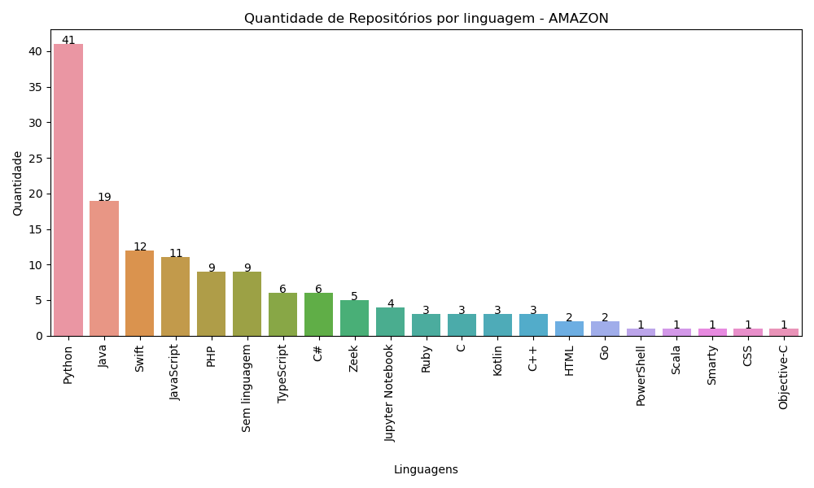
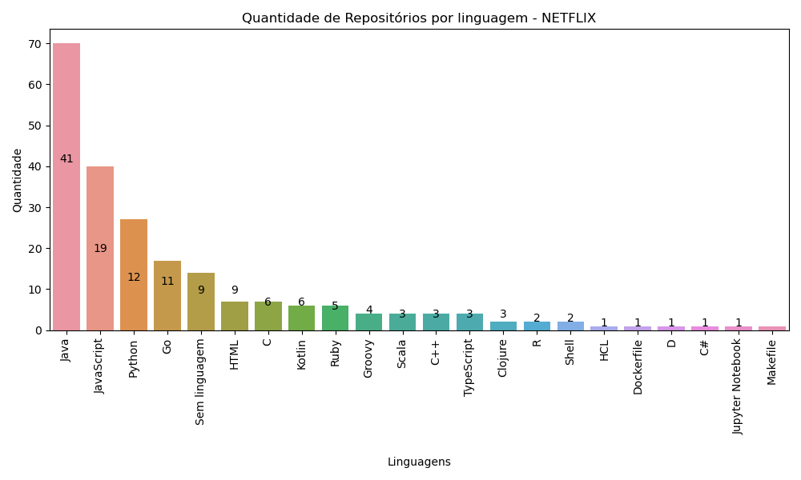
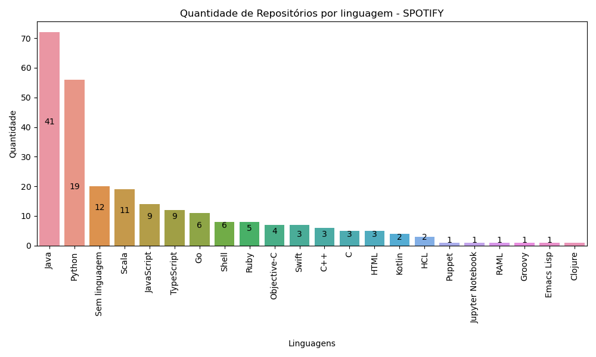
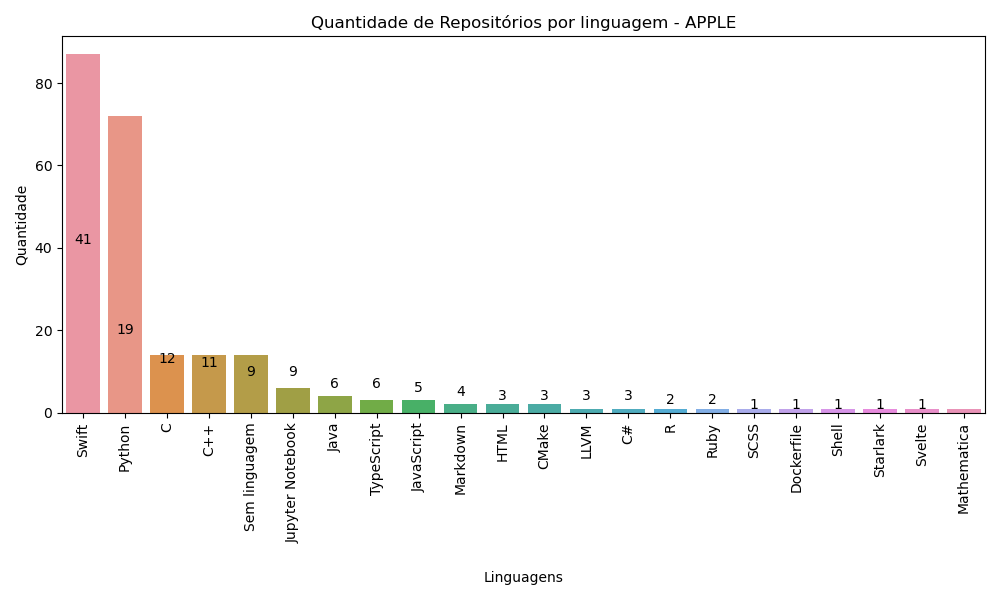

# Análise de Linguagens utilizadas em Big Techs!

## Python e APIs: conhecendo a biblioteca Requests

Excelente curso desenvolvido pela **Alura**, para Formação em Data Science. O curso é voltado especificamente para Engenharia de Dados, com a criação de pipeline de dados para extração de informações do GitHub e posterior Análise de Dados.

## Finalidade do Pipeline ETL

O pipeline ETL desenvolvido durante o curso tem como objetivo identificar quais são as linguagens de programação utilizadas nos repositórios públicos das contas no **GitHub** de quatro _Big Techs_ escolhidas: **Amazon, Netflix, Apple e Spostify**.
Esses dados foram extraídos utilizando a API do GitHub e a biblioteca Requests do Python. Esses dados coletados foram inseridos em DataFrames da biblioteca pandas para serem tabulados e analisados.

### Habilidades adquiridas:

- ⭕️ Desenvolver um _pipeline ETL_ utilizando a biblioteca [Requests](https://requests.readthedocs.io/en/latest/) do Python
- ⭕️ Empregar os recursos da biblioteca Requests para extrair dados da API do GitHub
- ⭕️ Utilizar as requisições GET, POST, PUT e DELETE
- ⭕️ Identificar diferentes status codes
- ⭕️ Realizar o processo de autenticação na API do GitHub
- ⭕️ Executar o processo de paginação
- ⭕️ Exercitar os principais conceitos de POO
- ⭕️ Análise de Dados utilizando a biblioteca [pandas](https://pandas.pydata.org/docs/)
- ⭕️ Gerar gráficos utilizando a biblioteca [Matplotlib](https://matplotlib.org/stable/users/index.html) e [seaborn](https://seaborn.pydata.org/tutorial/introduction.html)

### Ferramentas utilizadas

- Ecossistema Python [Anaconda](https://www.anaconda.com/about-us) e [Jupyter Notebook](https://jupyter.org/)
- IDE [VS Code](https://code.visualstudio.com/)

  
  
  
  
  
  
  
  
  
  
  
  
  

### Etapas do pipeline de ETL (Extract, Transform, Load)

- Conhecendo a biblioteca Requests (pasta 'conhecendo_requests')
- Extrair os dados da API do GitHub, utilizando a biblioteca Requests, requisições GET, com autenticação e paginação (pasta 'extraindo_dados')
- Pipeline ETL com tratamentos de erros (pasta 'extraindo_dados')
- Transformação dos dados obtidos em entruturas de dados da biblioteca pandas, os DataFrames (pasta 'transformando_dados')
- Armazenamento dos dados, utilizandos as requisições POST e PUT, e transformação dos DataFrames em arquivos CSV (pasta 'armazenando_dados')
- Requisições DELETE (pasta 'estruturando_codigo')
- Otimização das paginações, utilização da programação orientada a objetos e modularização do projeto, para melhor organização (pasta 'estruturando_codigo')
- Módulos 'dados_repos.py' e 'manipula_repos.py': classes para automatizar e facilitar a utilização do ETL

### Análise de Dados

Finalizado o processo de ETL, temos 4 DataFrames contendo a quantidade de repositórios públicos das 4 Big Techs escolhidas, com as linguagens utilizadas em cada repositório. Utilizando o pandas, foi realizado agrupamento e contagem, por linguagem de programação. Desta forma, podemos contabilizar quantos repositórios temos por cada linguagem de programação contabilizada na conta do GitHub.

### Gráficos

Após essa análise feita, utilizando o matplotlib e o seaborn, podemos analisar os seguintes gráficos:

#### Amazon

#### Netflix

#### Spotify

#### Apple

#### Linguagem mais popular

Uma das finalidades deste pipeline ETL e esta análise de dados realizada com base nestes repositórios públicos é, por exemplo, identificar quais são as linguagens de programação mais utilizadas nos projetos dessas empresas, visando direcionar um estudo dessas linguagens.
Como podemos analisar, nas empresas **Amazon, Netflix, Spotify e Apple** a linguagem de programação **Python** sempre está entre as mais utilizadas, sempre entre os Top 3. Portanto, podemos concluir que o Python é uma linguagem de programação muito utilizada nessas empresas, e que vale a pena estudar essa linguagem.
